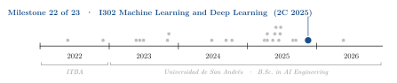
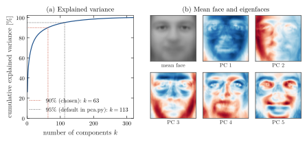
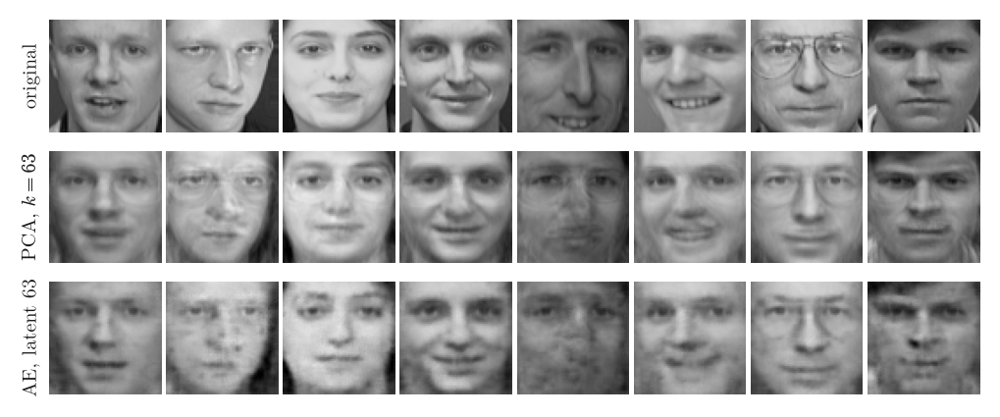
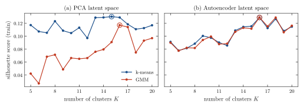
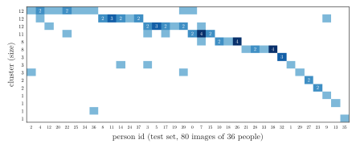

<div align="center">

# Face Images: PCA, a Convolutional Autoencoder and Clustering

**Santiago Groba Alonso**

Universidad de San Andrés · *Machine Learning and Deep Learning (I302)* · Second semester 2025 · Assignment 4

[](#reproducing-the-results)
[](#reproducing-the-results)

<picture>
  <source media="(prefers-color-scheme: dark)" srcset="docs/figures/trajectory-dark.svg">
  
</picture>

</div>

> **Abstract.** We reduce 400 grayscale face images (64×64 pixels, 40 people) to 63 dimensions with PCA and with a convolutional autoencoder, and cluster the codes with k-means and a Gaussian mixture. PCA, k-means, the mixture model and all metrics are written from scratch in NumPy, as the assignment requires; only the autoencoder uses PyTorch. Sixty-three principal components explain 90 % of the variance of the standardized training images. On the 80 held-out images the autoencoder, with the same latent size, does not beat PCA: its reconstruction MSE is 0.173 against 0.162 in standardized units. Silhouette scores are low for every model (at most 0.13) and select 15–16 clusters, well below the 40 identities. The best agreement with the identities is the mixture model on autoencoder codes with $K = 16$ (ARI 0.18, NMI 0.69): completeness is high (0.85), so each person tends to stay in one cluster, but homogeneity is low (0.58), because the large clusters mix several people.

---

## 1. Problem

The assignment asks for an unsupervised pipeline without machine-learning libraries except where stated:

1. **Data inspection.** A function to plot any number of faces, a look at the class distribution, and an 80/20 train/test split.
2. **Dimensionality reduction.** Standardization and PCA implemented by hand; keep the components that explain 90 % of the variance; train a deterministic autoencoder in PyTorch with the same latent dimension; compare reconstructions; encode all images with both models.
3. **Clustering.** k-means and a Gaussian mixture model (GMM) for $K \in [5, 20]$ on the latent codes; choose $K$ (diminishing returns and silhouette score) and analyse the clusters against the true identities.

## 2. Methods

| Component | Choice |
|---|---|
| Data | `data/caras.csv`: 400 grayscale images of 64×64 pixels, 10 per person for 40 people, values in [0, 1] |
| Split | Random permutation with seed 42: 320 training and 80 test images; the test set is also the autoencoder's validation set |
| Standardization | Per-pixel mean and standard deviation of the training images |
| PCA | SVD of the standardized 320×4096 training matrix; $k = 63$ components (saved in `modelo_pca.npz`) |
| Autoencoder | Encoder: three 3×3 convolutions with stride 2 (1→16→32→64 channels, ReLU) and a linear layer to 63 units; mirrored decoder with transposed convolutions. MSE loss, Adam (lr $10^{-3}$), batch 32, mixed precision on a GPU, early stopping with patience 10 on the test loss |
| k-means | $K$ distinct random training points as initial centroids (seed 42), 300 Lloyd iterations |
| GMM | Diagonal covariances, EM, means initialized with k-means |
| Choice of $K$ | Silhouette score of the training codes, $K = 5, \dots, 20$ |
| External metrics | Adjusted Rand index (ARI), normalized mutual information (NMI), homogeneity and completeness of the test-set assignments against the person id |

## 3. Results

Every number below is reproduced by `docs/figures/make_figures.py` from the repository's modules and saved artifacts (`modelo_pca.npz`, `autoencoder_best.pth`, `clustering_datasets.npz`) and matches the saved notebook outputs wherever the notebook printed the same quantity.

### 3.1 Principal components

<p align="center"></p>

**Figure 1.** (a) Cumulative explained variance of the standardized training images. The first component explains 26.2 % and the first five 54.7 %; 63 components reach 90 % and 113 reach 95 % (the default threshold in `pca.py`). (b) Mean training face and the first five principal components (eigenfaces; red and blue are opposite signs). The first components mainly capture lighting (PC 2 is a left–right illumination gradient) and the face outline.

### 3.2 Reconstruction: PCA against the autoencoder

<p align="center"></p>

**Figure 2.** Eight test faces (top) and their reconstructions from 63 numbers with PCA (middle) and with the autoencoder (bottom). Both models turn the faces towards the camera and lose fine detail; PCA leaves a faint trace of glasses on faces without them, while the autoencoder avoids that but produces blotchy artifacts on some faces.

**Table 1.** Reconstruction error on the 80 test images, both with 63 latent dimensions.

| Model | MSE, standardized pixels | MSE, pixel values in [0, 1] |
|---|---:|---:|
| PCA ($k = 63$) | **0.162** | **0.0031** |
| Convolutional autoencoder (63) | 0.173 | 0.0033 |

Early stopping ended autoencoder training after about 70 epochs, with a training loss of 0.094 against a best test loss of 0.1725: with 320 training images the network overfits well before it matches PCA on held-out faces.

### 3.3 Choosing the number of clusters

<p align="center"></p>

**Figure 3.** Silhouette score of the training codes as a function of $K$; circles mark the maximum. On PCA codes k-means peaks at $K = 15$ (0.130) and the GMM at $K = 16$ (0.117); on autoencoder codes both peak at $K = 16$ (0.129). The curves are low and jagged, which means there is no clear cluster structure at any $K$ in 63 dimensions.

**Table 2.** Test-set agreement between clusters and identities, with $K$ chosen by silhouette.

| Model | $K$ | ARI | NMI | Homogeneity | Completeness |
|---|---:|---:|---:|---:|---:|
| k-means, PCA codes | 15 | 0.132 | 0.651 | 0.544 | 0.811 |
| GMM, PCA codes | 16 | 0.151 | 0.688 | 0.567 | **0.876** |
| k-means, AE codes | 16 | 0.161 | **0.691** | **0.591** | 0.831 |
| GMM, AE codes | 16 | **0.177** | 0.689 | 0.580 | 0.848 |

### 3.4 What the clusters contain

<p align="center"></p>

**Figure 4.** Test images per person (columns) and cluster (rows) for the GMM on autoencoder codes; numbers mark cells with more than one image. Four large clusters (11–12 images) each gather 6–10 people, and 7 of the 15 non-empty clusters contain a single person. Because the random split is not stratified, the test set has 36 of the 40 people with 1 to 6 images each.

## 4. Takeaways

- Faces in a small, aligned dataset are close to a linear subspace: at equal latent size, PCA reconstructed held-out faces better than a convolutional autoencoder trained on 320 images.
- The silhouette criterion chose $K \approx 16$, not the 40 identities: with 10 images per person under different poses and lighting, a person is not a compact cloud in either latent space.
- NMI (0.65–0.69) looks good while ARI (0.13–0.18) does not. With 80 images and 36 classes NMI rewards many small, pure clusters; ARI is the stricter summary here.

## Reproducing the results

```bash
pip install numpy pandas matplotlib
python docs/figures/make_figures.py      # about 20 s; regenerates Figures 1–4 and prints Tables 1–2
```

The script evaluates `autoencoder_best.pth` with a NumPy re-implementation of the network's forward pass and checks it against the latent codes saved in `clustering_datasets.npz`, so PyTorch is not needed. To re-run the notebook itself (including autoencoder training), install `torch` as well and open `Groba_Santiago_Notebook_TP4.ipynb` from the repository root.

| File | Content |
|---|---|
| `Groba_Santiago_Notebook_TP4.ipynb` | Submitted notebook: inspection, PCA, autoencoder, clustering and evaluation |
| `pca.py` | Standardization and PCA via SVD |
| `kMeans.py`, `GMM.py` | k-means and diagonal-covariance Gaussian mixture (EM) |
| `metrics.py` | Silhouette score, ARI, NMI, homogeneity, completeness and V-measure |
| `dataVisual.py` | Image loading and plotting helpers |
| `data/caras.csv` | 400 face images (4,096 pixel columns and `person_id`) |
| `modelo_pca.npz` | Training mean and standard deviation and the 63 principal components |
| `autoencoder_best.pth` | Autoencoder weights (PyTorch state dict) |
| `clustering_datasets.npz` | 63-dimensional PCA and autoencoder codes of the training and test images, with labels |
| `docs/figures/` | Script and style used for the figures in this README |

## Acknowledgements

Assignment and data by the teaching staff of *Machine Learning and Deep Learning* (I302). The images in `data/caras.csv` (40 people × 10 grayscale images of 64 × 64 pixels, values in [0, 1]) appear to be the Olivetti faces as distributed by scikit-learn, taken from the ORL Database of Faces (AT&T Laboratories Cambridge): F. Samaria and A. Harter, "Parameterisation of a stochastic model for human face identification", *Proc. 2nd IEEE Workshop on Applications of Computer Vision*, 1994.

## Citation

```bibtex
@misc{groba2025faces,
  author       = {Groba Alonso, Santiago},
  title        = {Face Images: PCA, a Convolutional Autoencoder and Clustering},
  year         = {2025},
  howpublished = {Universidad de San Andr{\'e}s, Machine Learning and Deep Learning (I302)},
  url          = {https://github.com/Santi2065/faces-pca-autoencoder-clustering}
}
```
